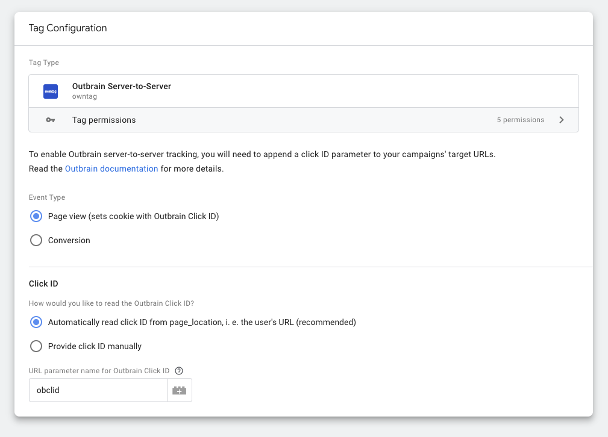

# Outbrain Server-to-Server tag template for Google Tag Manager Server Side Container

This is a template for a Google Tag Manager Server Side Container tag that sends data to Outbrain.  
The tag is designed to be used with the Outbrain Amplify campaigns.

Created by [owntag](https://www.owntag.eu), compatible with any Google Tag Manager Server Side Container.

